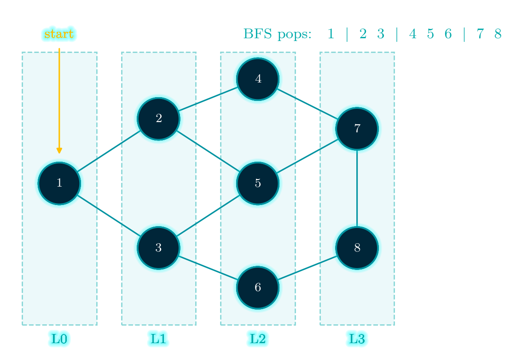
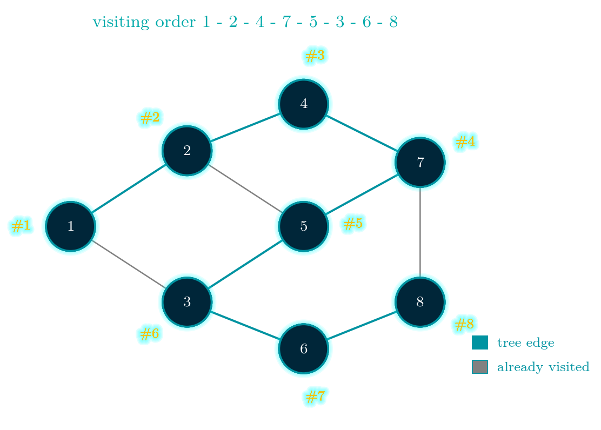
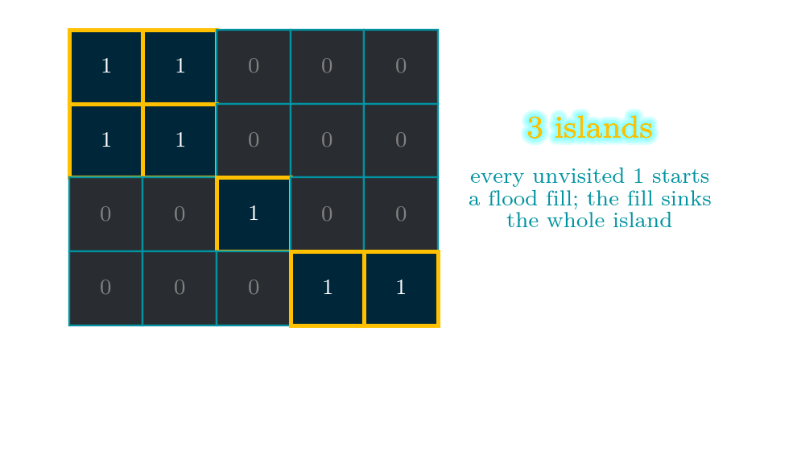

# Day 12 — Graph Traversal: BFS and DFS

*100 Days of Python — day 12*

Yesterday we built a graph. Today we learn to walk it, because a graph you cannot walk
through is just a pile of edges.

Almost everything that comes next in this series — topological sort, minimum spanning
trees, shortest paths, connected components, cycle detection — is one of the two
traversals below with some extra bookkeeping bolted on. So this is a short day with a
long tail.

## One algorithm, two containers

Here is the whole idea. Keep a container of vertices you have *discovered* but not yet
*expanded*. Take one out, look at its neighbours, put the new ones in. Repeat until the
container is empty.

That is it. The only choice you make is what the container is:

- a **queue** (FIFO) gives you **breadth-first search**
- a **stack** (LIFO) gives you **depth-first search**

Two data structures from day 02, and they produce two completely different-looking
traversals.

## Breadth-first search

BFS pops the oldest discovered vertex first, so it finishes everything at distance 1
before touching anything at distance 2. The traversal comes out in rings around the
start:



```python
from collections import deque

def bfs(graph, start):
    """Return (visit order, distance from start, parent pointers)."""
    visited = {start}
    dist = {start: 0}
    parent = {start: None}
    order = []
    queue = deque([start])

    while queue:
        u = queue.popleft()
        order.append(u)
        for v in sorted(graph.neighbors(u)):
            if v not in visited:
                visited.add(v)              # mark on push, not on pop
                dist[v] = dist[u] + 1
                parent[v] = u
                queue.append(v)
    return order, dist, parent
```

There is exactly one line in there that people get wrong, and it is the comment.

**Mark a vertex as visited when you push it, not when you pop it.** If you mark on pop,
a vertex that two different parents can reach gets pushed twice, and you process it
twice. On a small graph you will not notice; on a grid with a million cells you will,
because the queue quietly blows up.

The pay-off for carrying `dist` and `parent` around is that BFS on an unweighted graph
does not just visit vertices — it visits them in non-decreasing order of distance. So
`dist` *is* the shortest path length in edges, and walking `parent` backwards gives you
the path itself:

```python
def shortest_path(graph, start, goal):
    _, dist, parent = bfs(graph, start)
    if goal not in parent:
        return None                     # unreachable
    path = []
    node = goal
    while node is not None:
        path.append(node)
        node = parent[node]
    return path[::-1]
```

This is the machinery behind maze solvers, word ladders, and "degrees of separation"
queries on a social graph. Nothing fancier is required as long as every edge costs the
same. The moment edges have different weights, this breaks, and we need a heap instead
of a queue — that is day 17, Dijkstra.

## Depth-first search

Swap the queue for a stack and the traversal turns inside out. DFS commits to a branch
and rides it to the end before backing up:



```python
def dfs_recursive(graph, start, visited=None, order=None):
    if visited is None:
        visited, order = set(), []
    visited.add(start)
    order.append(start)
    for v in sorted(graph.neighbors(start)):
        if v not in visited:
            dfs_recursive(graph, v, visited, order)
    return order
```

The recursive version is the one worth memorising because it reads like the definition:
mark yourself, then recurse into whichever neighbours have not been marked. The stack
is the call stack.

There is an iterative version too, and it is not just a stylistic preference — CPython
gives you about a thousand stack frames before it raises `RecursionError`, and a long
thin graph will find that limit:

```python
def dfs_iterative(graph, start):
    visited, order = set(), []
    stack = [start]
    while stack:
        u = stack.pop()
        if u in visited:
            continue
        visited.add(u)
        order.append(u)
        for v in sorted(graph.neighbors(u), reverse=True):
            if v not in visited:
                stack.append(v)
    return order
```

Notice that the iterative version checks `visited` on pop as well as on push. That is
not the bug I warned about above — with a stack you genuinely can have the same vertex
sitting in two places, and the cheapest fix is to skip it when it comes out.

Look at the grey edges in the figure. Those are the edges DFS *did not* walk, because
both endpoints were already visited. The teal edges form the **DFS tree**. That split —
tree edges versus everything else — is not a curiosity: classifying the non-tree edges
is precisely how you detect cycles, find bridges and articulation points, and compute
strongly connected components. We will cash that in on day 19.

## Which one should I reach for?

| | BFS | DFS |
|---|---|---|
| container | queue | stack / recursion |
| finds | shortest path on an unweighted graph | *a* path, any path |
| memory | O(width) — can be enormous | O(depth) |
| natural for | levels, distances, "closest" | cycles, components, ordering, backtracking |

Both are O(V + E): every vertex enters the container once, and every edge is inspected
once from each end. The difference is memory. On a wide, shallow graph BFS holds an
entire frontier in the queue; on a deep, narrow graph DFS holds the entire path on the
stack. Pick the one whose worst case your graph does not have.

## The problem: LeetCode 200, Number of Islands

> Given an `m x n` binary grid where `'1'` is land and `'0'` is water, return the number
> of islands. An island is formed by connecting adjacent lands horizontally or
> vertically.

The reason this problem is worth 15 minutes is not the code — it is noticing that it is
a graph problem wearing a costume. Every land cell is a vertex. Two land cells share an
edge when they are orthogonally adjacent. Counting islands is counting connected
components, which is the traversal we already wrote, run in a loop over every unvisited
vertex.



```python
def num_islands_bfs(grid):
    if not grid or not grid[0]:
        return 0
    rows, cols = len(grid), len(grid[0])
    grid = [list(row) for row in grid]      # work on a mutable copy
    count = 0

    for r in range(rows):
        for c in range(cols):
            if grid[r][c] != '1':
                continue
            count += 1                      # found a fresh island
            queue = deque([(r, c)])
            grid[r][c] = '0'                # sink it: the grid is our visited set
            while queue:
                i, j = queue.popleft()
                for di, dj in ((1, 0), (-1, 0), (0, 1), (0, -1)):
                    ni, nj = i + di, j + dj
                    if 0 <= ni < rows and 0 <= nj < cols and grid[ni][nj] == '1':
                        grid[ni][nj] = '0'
                        queue.append((ni, nj))
    return count
```

The trick that makes it short is sinking the land as you go. You do not need a
`visited` set, because a cell you have already counted is no longer a `'1'`. Two things
to say out loud in an interview: this mutates the input (so copy it if that matters),
and the BFS version bounds memory at O(min(m, n)) whereas the recursive flood fill can
put m×n frames on the call stack. On a 1000×1000 grid of solid land, that is the
difference between an answer and a `RecursionError`.

Time complexity is O(m × n) — every cell is visited a constant number of times and sunk
at most once.

## Why this matters later

Tomorrow is **topological sort**, which is DFS plus a post-order timestamp — or BFS run
over in-degrees, depending on which flavour you like. Then Kruskal and Prim grow a tree
the same outward way, and Dijkstra turns out to be BFS with the queue replaced by the
day 05 heap.

If you only remember one thing from today: the container determines the order, and the
order determines what the traversal is good for.

Code and notebook: [day 12 on GitHub](https://github.com/KingRei/100DaysPython/tree/master/day%2012%20-%20graph%20traversal)

*Next: Day 13 — topological sort, and why a course schedule is really a DAG.*
